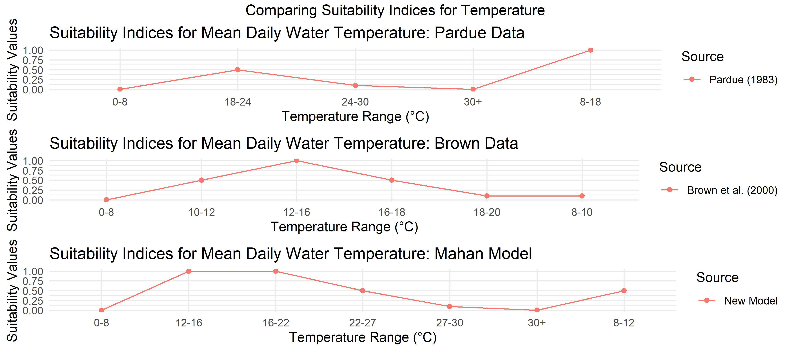
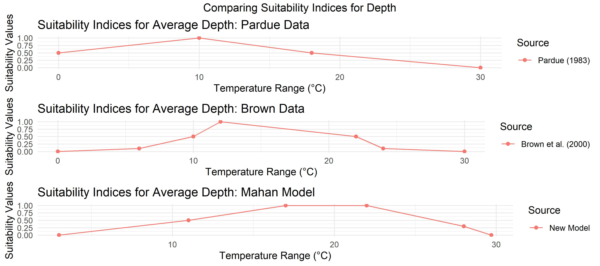

# Alewives

This chapter aims to explore the habitat preferences and life cycle of alewives (Alosa pseudoharengus) in the northeastern United States. Alewives have faced significant declines, leading to their classification as a "species of concern" by the U.S. National Marine Fisheries Service [@nmfs_national_marine_fisheries_service_species_2009]. A combination of factors that have contributed to this decline, including deteriorating water quality, habitat loss, offshore bycatch/overfishing, increased predation, and dam construction [@kocovsky_linking_2008; @nmfs_national_marine_fisheries_service_species_2009; @bethoney_environmental_2014; @waldman_north_2022]. They have also been considered for inclusion in the U.S. Endangered Species List, as indicated in reports by the National Marine Fisheries Service in 2013 [@nmfs_national_marine_fisheries_service_endangered_2013].

Recent stock assessment reports reveal diverse trends in documented alewife runs over the last ten years, with some populations showing signs of stabilization or even growth [@asmfc_river_2017]. Additionally, in 2019, the National Marine Fisheries Service concluded that listing the alewife as threatened or endangered under the Endangered Species Act (ESA) was not warranted [@nmfs_national_marine_fisheries_service_not_2019].

Alewives are widely distributed throughout the northeastern United States, thriving in freshwater rivers and estuaries along the Atlantic coast [@asmfc_fishery_1985]. Historically, alewives have undertaken extensive migrations to spawn in freshwater tidal systems, but limited information is available about estuary and marine movements during the juvenile and adult phases for alewives [@mccartin_new_2019].

This chapter explores the favorable habitat conditions for spawning alewife adults, non-migratory juveniles, and larvae, which are influenced by factors such as suitable spawning habitats, water quality conditions, and availability of appropriate food resources [@lynch_projected_2015].

## Life cycle overview

Alewives exhibit a complex life cycle characterized by distinct stages and behaviors. Spawning typically occurs in waves during the spring season, triggered by rising water temperatures and increasing day length [@asmfc_amendment_2009; @mccartin_new_2019; @able_alewife_2020]. Adult alewives migrate upstream from marine environments to reach suitable brackish or freshwater spawning habitats [@bigelow_fishes_1953; @bigelow_bigelow_2002]. Recent observations show that alewife migration can also be correlated with the lunar phase [@legett_daily_2021].

Upon arrival at the spawning grounds, adult alewives engage in immense spawning runs, where large aggregations gather to deposit their adhesive eggs over a variety of substrates [@oconnell_spawning_1997; @able_alewife_2020]. After spawning, both males and females return to the marine environment[@bigelow_fishes_1953; @bigelow_bigelow_2002].

In the spawning habitat, the incubation period for eggs typically lasts for 3-6 days [@bigelow_fishes_1953; @munroe_overview_2000; @bigelow_bigelow_2002]. Once hatched, the larvae begin their rapid migration downstream, eventually making their way towards estuary habitats where they will reside as they grow [@pardue_habitat_1983]. This estuary environment serves as a nursery for juvenile alewives until they eventually migrate to the sea [@laney_relationship_1997; @kosa_processes_2001]. It is noteworthy that the survival rate for larvae is relatively low, with only a small percentage successfully reaching the sea for each female alewife that entered the spawning grounds. This percentage can be as low as 1% or even less, depending on the specific conditions of the ecosystem [@kissil_spawning_1974]. Similarly, mortality rates for migratory adults during a spawning season can reach as high as 90% in southern regions [@brady_part_2005]. 

## Habitat Requirements 

### Spawning Adult Alewives 

Spawning adult alewives exhibit specific preferences and requirements related to habitat characteristics. Their annual migration during spawning is energetically demanding and notable variations in behavior have been observed. Some studies report fasting during the day and extensive feeding at night, while others document refraining from eating until their return downstream to productive tidal habitats [@bigelow_fishes_1953; @janssen_feeding_1980; @bigelow_bigelow_2002]. The preferred habitats for spawning are lacustrine and fluvial environments rather than riverine [@reback_survey_2004; @frank_role_2011].

Temperature preferences during spawning vary across studies, but there is a consensus that optimal temperatures for successful spawning fall within the range of 12 to 16 degrees Celsius [@brown_habitat_2000]. Suitable spawning temperatures broadly span from 12 to 22 degrees Celsius [@tyus_movements_1974; @pardue_habitat_1983; @collette_fishes_2003; @mather_assessing_2012] and during the migration inland, alewives tend to favor offshore locations where bottom temperatures are between 7 and 11 degrees Celsius [@munroe_overview_2000]. Spawning activity significantly diminishes above 27 degrees Celsius [@kissil_spawning_1974; @pardue_habitat_1983; @brown_habitat_2000]. Deviations from the optimal temperature range can significantly impact spawning success and the timing of migration. Water temperature also plays a critical role in alewife abundance and movement patterns [@legett_daily_2021].

In terms of depth preferences, spawning adult alewives are generally known to favor depths ranging from Mean Low Tide (MLT) to 10 meters [@brown_habitat_2000], but recent field observations indicate that a significant proportion of alewives can be found in habitats as shallow as 2 meters [@mather_assessing_2012]. Offshore alewives migrating inland have been documented to favor deeper depths (depth < 100m) [@pardue_habitat_1983; @munroe_overview_2000]. As such, alewives are capable of spawning in both shallow and deep water environments, highlighting their adaptability in selecting suitable spawning locations.

Further, documented behavior of alewives challenges the conventional belief that anadromous species exclusively depend on freshwater environments for spawning. Alewives have been observed spawning in freshwater habitats with minimal salinity concentrations, revealing a preference for environments with salinity levels below 0.5 psu. However, they can tolerate salinity levels as high as 5 psu for successful spawning, as documented in the study conducted by @pardue_habitat_1983. More recently, @brown_habitat_2000 emphasizes an additional heightened preference for habitats with salinity concentrations below 15 psu, while concentrations surpassing 20 psu are deemed unsuitable for spawning adults. Additionally, field studies have documented that adult alewives engage in spawning activities across a diverse array of estuarine habitats with varying salinity levels, including ponds within coastal systems, pond-like regions within coastal rivers and streams, oxbows, eddies, backwaters, stream pools, and flooded swamps [@pardue_habitat_1983; @mullen_species_1986; @collette_fishes_2003; @walsh_early_2005].

Flow velocity is a crucial factor influencing the spawning of alewives [@tommasi_effect_2015]. Alewives are thought to spawn in habitat that are slow moving with little or no current [@walsh_early_2005]. @pardue_habitat_1983 identifies velocities up to 0.3 m/s as suitable for spawning. However, @haro_swimming_2004 conducted laboratory experiments showing that migratory alewives can travel farther distances upstream when flow velocities are up to 1.5 m/s, compared to 3.5 m/s. Notably, these experiments indicate some suitability at these flow velocities and very little suitability for upstream migration when velocities reach 4.5 m/s [@haro_swimming_2004]. Understanding the preferred flow velocities is essential in managing and preserving the habitat conditions required for successful alewife spawning.

Previous studies have presented conflicting information regarding the substrate preferences of spawning adult alewives, often stemming from the generalization of alewives with blueback herring as river herring. Moreover, although @brown_habitat_2000 argues that substrate composition holds no significance in alewife models, contrasting observations from various sources present compelling evidence in favor of a more defined range of substrate preferences among spawning alewives [ @fay_alewifeblueback_1983; @killgore_distribution_1988; @oconnell_spawning_1997; @able_alewife_2020]. Adult alewives spawn over a range of unconsolidated substrates, including small gravel, sand, vegetation, and other soft substrates [@pardue_habitat_1983; @oconnell_spawning_1997; @brown_habitat_2000]. Aside from their demonstrated dependence on soft substrates, spawning adult alewives also exhibit a pronounced inclination toward habitats containing sub-aquatic vegetation [@killgore_distribution_1988; @laney_relationship_1997]. Comprehending and defining these substrate preferences is crucial to effectively manage and conserve the appropriate spawning habitats for alewives.

### Non-migratory Juvenile Alewives and Larvae

Non-migratory juvenile alewives and larvae exhibit distinct habitat preferences and requirements, which play a crucial role in influencing their survival and growth. Several factors influence the abundance and successful development of these young alewives, including river flow, temperature, salinity, depth, and substrate [@pardue_habitat_1983; @walsh_early_2005; @tommasi_effect_2015]. The preferred habitats for juveniles and alewife larvae are also lacustrine and fluvial environments [@overton_spatial_2012].

Temperature significantly influences the distribution, behavior, and early development of non-migratory juvenile alewives and larvae [@tommasi_effect_2015]. Optimal temperatures for juvenile alewife development and larvae hatching fall within the range of 17°C to 22°C, with a broader suitability range for juvenile and larvae recruitment from 11°C to 28°C [@pardue_habitat_1983; @fay_alewifeblueback_1983; @klauda_alewife_1991; @brown_habitat_2000; @munroe_overview_2000; @tommasi_effect_2015]. Juvenile river herring do not survive temperatures of 3°C or less and hatching success ceases entirely above 29.7°C [@otto_lethal_1976; @kellogg_temperature_1982; @pardue_habitat_1983]. Maintaining water temperatures within these ranges is crucial for the successful development and overall health of non-migratory juvenile alewives and larvae.

The depth preferences of non-migratory juvenile alewives differ from their adult counterparts, as juveniles exhibit a preference for depths ranging from 0 to 10 meters, with no habitat suitability observed beyond 20 meters [@brown_habitat_2000; @hook_annual_2008]. Research by @pardue_habitat_1983 further supports this finding, indicating that juveniles prefer depths between 0.5 to 5 meters. Lake Ontario research by @ingel_habitat_2013 found that early post-hatch larvae are abundant in depths less than 3 meters, while larger larvae occupy progressively deeper habitats. Similarly, observations in Nova Scotia's Margaree River indicate that alewife larvae predominantly reside in depths shallower than 2 meters, while juvenile abundance increases around five meters deep [@gibson_statistical_2003]. Overall, these field observations indicate that optimal depth for juvenile alewives and larvae is <5 meters. These shallow-water habitats provide protection from predators and access to food sources, facilitating growth before downstream migration.

Juvenile alewives exhibit a distinct salinity preference, favoring concentrations exceeding 10 psu and even tolerating levels up to 30 psu [@pardue_habitat_1983; @brown_habitat_2000]. Research by @fay_alewifeblueback_1983 notes their presence in areas with salinity below 12 psu, indicating adaptability to lower salinity environments. @turner_juvenile_2016 along with @able_alewife_2020 emphasize the preference of juveniles for estuarine habitats with salinity concentrations spanning 0.5 to 25 psu, promoting an ideal balance between freshwater and marine conditions for growth. While salinities exceeding 20 psu might impede suitability by affecting feeding and physiological processes [@fabrizio_extent_2021], higher salinities up to 30 psu show minimal adverse effects on the health and survival of juvenile alewives, with a 100% survival rate observed at 15 psu [@dimaggio_spawning_2015]. In summary, juvenile alewives exhibit a versatile salinity preference that ranges from thriving in concentrations exceeding 10 psu up to tolerating levels as high as 30 psu, highlighting their adaptability to diverse environments for optimal growth and survival.

Flow velocity is a crucial determinant of the development and survival of non-migratory juvenile alewives [@tommasi_effect_2015]. Previous optimal velocities for larvae and egg development were observed from 0 to 0.3 m/s [@pardue_habitat_1983]. Other studies document juvenile alewife preference for habitats with flow velocities ranging from 0.05 to 0.17 m/s [@richkus_response_1975; @oconnell_habitat_1999]. Larval alewives are consistently found in water velocities up to approximately 0.12 m/s, but they are absent in faster currents [@ingel_habitat_2013]. Slower flow rates offer suitable conditions for juveniles and larvae to conserve energy while effectively foraging for food [@haro_swimming_2004]. Conversely, higher flow velocities may hinder their ability to access critical food resources, maintain their position in the water column, and displace recently spawned eggs from their initial location [@haro_swimming_2004; @able_alewife_2020]. Understanding the flow velocity preferences and effects on non-migratory juvenile alewives and larvae is crucial for effective habitat management and successful transition from egg to adulthood.

non-migratory juvenile alewives exhibit diverse substrate preferences that reflect their adaptability to various environments. While previous studies suggest a preference for sandy substrates @fay_alewifeblueback_1983, more recent observations indicate a potential preference for rocky substrates [@janssen_preference_2004; @boscarino_influence_2020]. Seagrass coverage also plays a vital role in the habitat of these juveniles. Despite some studies suggesting avoidance of areas with aquatic vegetation @ingel_habitat_2013, research by @laney_relationship_1997 and @smith_overlapping_2015 demonstrates that seagrass beds provide essential nursery habitat, offering refuge from predators and abundant food sources. Seagrass beds enhance water quality by stabilizing sediments and promoting nutrient cycling, creating a favorable environment for juvenile alewives to thrive. These vegetated areas are also crucial for overwintering habitat [@killgore_distribution_1988]. Understanding these diverse substrate preferences and the importance of seagrass coverage is essential for effective habitat management and the successful development of non-migratory juvenile alewives.

## Habitat suitability models

The Alewives Habitat Suitability models, originally developed by @brown_habitat_2000 and @pardue_habitat_1983, with reliance on similar sources such as @bigelow_fishes_1953, possess several limitations that make them inadequate for current applications. Primarily, these models are constructed solely on observations of alewives' daytime behavior, neglecting their significant nocturnal activity patterns. Recent studies have revealed that alewives are primarily active at night, engaging in feeding and exhibiting substantial downstream movement during these nocturnal periods [@janssen_will_1978; @janssen_feeding_1980; @mccartin_new_2019]. @collette_fishes_2003 even notes that groups of alewives spawn in the evening. Consequently, the exclusive focus on daytime behavior in the existing models fails to capture the true habitat preferences and requirements of alewives, particularly in estuary and brackish environments. 

Furthermore, the current models predominantly consider variables such as temperature, depth, and substrate, while disregarding other crucial factors that significantly influence alewives' habitat selection, including flow velocity, sub-aquatic vegetation, and life stage differences. This limited scope results in incomplete assessments of habitat suitability. Moreover, the existing models fall short of encompassing the comprehensive spectrum of knowledge available for alewives, as inconsistencies and potential inaccuracies emerge from conflicting information concerning substrate, salinity, and depth preferences. These limitations undermine the models' effectiveness in predicting habitat suitability for alewives, and since the release of these models, updated observations and stock assessments have been published that offer more detailed information on the habitat for alewives.

To address these shortcomings, updated models should encompass a more comprehensive understanding of alewives' behavior, specifically acknowledging their use of estuarine and brackish habitats. These habitats serve as critical areas for alewives, exhibiting relatively high levels of habitat use [@mccartin_new_2019; @stevens_evidence_2021]. Incorporating these estuarine and brackish areas into management strategies is of paramount importance to ensure the conservation and successful management of the species. Notably, utilizing estuaries and brackish habitats for spawning may offer energetically favorable conditions for alewives, as it eliminates the need for them to acclimate to complete freshwater environments [@dimaggio_spawning_2015]. This recognition highlights the significance of incorporating these habitats into conservation efforts and management plans to safeguard the species and support their reproductive success.

### Spawning Adult Alewives

The updated HSI model for spawning adult alewives introduces several noteworthy breakpoints that distinguish it from previous models. These breakpoints provide a more refined understanding of alewife habitat preferences and suitability.

```{r, echo= FALSE, include=TRUE, fig.align = "center", fig.cap="Spawning Adult Alewife Temperature Suitability Indices", out.width="80%", warning=FALSE}
# Load the ggplot2 library
library(ggplot2)
library(gridExtra)
# Your data
data <- data.frame(
  Temperature_Range_C = c("0-8","8-12","12-16","16-22","22-27","27-30","30+",
               "0-8","8-18","18-24","24-30","30+",
               "0-8","8-10","10-12","12-16","16-18","18-20","20-30","30+"),
  Suitability_Values = c(0.0,0.5,1.0,1.0,0.5,0.1,0.0,
         0.0,1.0,0.5,0.1,0.0,
         0.0,0.1,0.5,1.0,0.5,0.1,0.0,0.0),
  Source = c("New Model", "New Model", "New Model", "New Model", "New Model", "New Model", "New Model",
             "Pardue (1983)","Pardue (1983)","Pardue (1983)","Pardue (1983)","Pardue (1983)",
                    "Brown et al. (2000)","Brown et al. (2000)","Brown et al. (2000)","Brown et al. (2000)","Brown et al. (2000)","Brown et al. (2000)","Brown et al. (2000)","Brown et al. (2000)")
)
alewife_model <- data[1:7,]
pardue_data <- data[8:12, ]
brown_data <- data[13:18, ]

#Note that range=0, which means that whiskers extend to the minimum and maximum values.
jpeg(filename="Fig01.Adult_Alewife_Temp_HSI.jpeg", units="in", width=9, height=4, res=400)
par(mfrow=c(3,1))

# Create separate plots for each model
plot_alewife <- ggplot(alewife_model, aes(x = Temperature_Range_C, y = Suitability_Values, group = Source, color = Source)) +
  geom_line() +
  geom_point() +
  labs(
    x = "Temperature Range (°C)",
    y = "Suitability Values",
    title = "Suitability Indices for Mean Daily Water Temperature: Mahan Model"
  ) +
  theme_minimal()

plot_pardue <- ggplot(pardue_data, aes(x = Temperature_Range_C, y = Suitability_Values, group = Source, color = Source)) +
  geom_line() +
  geom_point() +
  labs(
    x = "Temperature Range (°C)",
    y = "Suitability Values",
    title = "Suitability Indices for Mean Daily Water Temperature: Pardue Data"
  ) +
  theme_minimal()

plot_brown <- ggplot(brown_data, aes(x = Temperature_Range_C, y = Suitability_Values, group = Source, color = Source)) +
  geom_line() +
  geom_point() +
  labs(
    x = "Temperature Range (°C)",
    y = "Suitability Values",
    title = "Suitability Indices for Mean Daily Water Temperature: Brown Data"
  ) +
  theme_minimal()

grid.arrange(arrangeGrob(plot_pardue, plot_brown, plot_alewife, nrow = 3), top="Comparing Suitability Indices for Temperature")
#Close jpeg creation
invisible(dev.off())

#Display figure

```

```{r, echo= FALSE, include=TRUE, fig.align = "center", fig.cap="Spawning Adult Alewife Temperature Suitability Indices", out.width="80%", warning=FALSE}
library(dplyr)
library(knitr)
library(kableExtra)
data= matrix(c("0-8","8-12","12-16","16-22","22-27","27-30","30+",
               "0-10","10-15","15-20","20-27","27+",
               "0-8","8-10","10-12","12-16","16-18","18-20","20+"), ncol=1, byrow=TRUE)

## create columns for table
HSI <- c(0.0,0.5,1.0,1.0,0.5,0.1,0.0,
         0.0,0.5,1.0,0.5,0.0,
         0.0,0.1,0.5,1.0,0.5,0.1,0.0)
data <-cbind(data, HSI)

# specify the column names and row names of matrix
colnames(data) = c('Temperature Range (C)', 'Suitability Values')
rownames(data) <- c('New Model','','','','','','',
                    "Pardue (1983)",'','','','',
                    "Brown et al. (2000)",'','','','','','')

# assign to table
final=as.table(data)
knitr::kable(x = data, #the data for the table
            caption = "Suitability Indices for Mean Daily Water Temperature: Spawning Adult Alewives",
            format = "markdown",
            escape = FALSE,
            booktabs = TRUE,
            align = "c",
            full_width = TRUE)  %>%   
kable_styling(full_width = T) %>%
column_spec(4,width_min = "20em") %>%
column_spec(5,width_min = "20em")
```

In contrast to earlier models, the new HSI model delineates mean daily temperature preferences with greater accuracy. While previous models often employed broader temperature categories, the current model introduces finer distinctions. For instance, the new model identifies a specific range (12 to 16 degrees Celsius) where alewives exhibit peak suitability, providing a more accurate depiction of their thermal requirements for successful spawning. Moreover, the model highlights an upper mean daily temperature limit (27 degrees Celsius) where suitability drastically decreases, emphasizing the importance of maintaining suitable thermal conditions in spawning habitats.

```{r, echo= FALSE, include=TRUE, fig.align = "center", fig.cap="Spawning Adult Alewife Depth Suitability Indices", out.width="80%", warning=FALSE}
data= matrix(c("0-2","2-10","10-20","20-50","50-100","100+",
               "NA",
               "0-MLT","MLT-3","3-10","10-20","20-50","50-100"), ncol=1, byrow=TRUE)

## create columns for table
HSI <- c(0.0,0.5,1.0,0.5,0.5,0.0,
         "NA",
         0.5,1.0,1.0,0.1,0.0,0.0)
data <-cbind(data, HSI)

# specify the column names and row names of matrix
colnames(data) = c('Depth Range (meters)', 'Suitability Values')
rownames(data) <- c('New Model','','','','','',
                    "Pardue (1983)",
                    "Brown et al. (2000)",'','','','','')

# assign to table
final=as.table(data)
knitr::kable(x = data, #the data for the table
            caption = "Suitability Indices for Average Depth: Spawning Adult Alewives",
            format = "markdown",
            escape = FALSE,
            booktabs = TRUE,
            align = "c",
            full_width = TRUE)  %>%   
kable_styling(full_width = T) %>%
column_spec(4,width_min = "20em") %>%
column_spec(5,width_min = "20em")
```

The updated model also offers more detailed depth preferences. Previous models might have employed generalized depth categories, but the new model introduces distinct depth ranges. This allows for a more refined assessment of habitat suitability. For instance, the new model specifies a peak suitability range (2 to 10 meters), reflecting the depth preferences of spawning adult alewives more accurately. Additionally, it identifies a depth threshold (100 meters) beyond which habitats are unsuitable for spawning.

```{r, echo= FALSE, include=TRUE, fig.align = "center", fig.cap="Spawning Adult Alewife Average Salinity Suitability Indices", out.width="80%", warning=FALSE}
data= matrix(c("0-0.5","0.5-5","5-15","15-20","20+",
               "0-6","6-14","14-20","20+",
               "0-0.5","0.5-5","5-10","10-15","15-20","20-25","25-30"), ncol=1, byrow=TRUE)

## create columns for table
HSI <- c(1.0,1.0,1.0,0.5,0,
         0.86,0.0,0.0,0.0,
         1.0,1.0,1.0,1.0,0.5,0.1,0.0)
data <-cbind(data, HSI)

# specify the column names and row names of matrix
colnames(data) = c('Salinity Range (psu)', 'Suitability Values')
rownames(data) <- c('New Model','','','','',
                    "Pardue (1983)",'','','',
                    "Brown et al. (2000)",'','','','','','')

# assign to table
final=as.table(data)
knitr::kable(x = data, #the data for the table
            caption = "Suitability Indices for Average Salinity: Spawning Adult Alewives",
            format = "markdown",
            escape = FALSE,
            booktabs = TRUE,
            align = "c",
            full_width = TRUE)  %>%   
kable_styling(full_width = T) %>%
column_spec(4,width_min = "20em") %>%
column_spec(5,width_min = "20em")
```

The new HSI model also refines the depiction of alewife salinity preferences. Unlike earlier models, which may have had narrow salinity categories, the updated model provides a more nuanced view. It pinpoints a specific range (0 to 5 psu) where alewives exhibit the highest suitability, aligning closely with empirical data. Moreover, it designates a clear upper limit (20 psu) where suitability declines significantly, indicating the importance of maintaining lower salinity levels in suitable habitats.

```{r, echo= FALSE, include=TRUE, fig.align = "center", fig.cap="Spawning Adult Alewife Flow Velocity Suitability Indices", out.width="80%", warning=FALSE}
data= matrix(c("0-0.3","0.3-1.5","1.5-3.5","3.5-4.5","4.5+",
               "NA",
               "NA"), ncol=1, byrow=TRUE)

## create columns for table
HSI <- c(1.0,1.0,0.5,0.3,0.0,
         "NA",
         "NA")
data <-cbind(data, HSI)

# specify the column names and row names of matrix
colnames(data) = c('Flow Velocity Range (m/s)', 'Suitability Values')
rownames(data) <- c('New Model','','','','',
                    "Pardue (1983)",
                    "Brown et al. (2000)")

# assign to table
final=as.table(data)
knitr::kable(x = data, #the data for the table
            caption = "Suitability Indices for Flow Velocity: Spawning Adult Alewives",
            format = "markdown",
            escape = FALSE,
            booktabs = TRUE,
            align = "c",
            full_width = TRUE)  %>%   
kable_styling(full_width = T) %>%
column_spec(4,width_min = "20em") %>%
column_spec(5,width_min = "20em")
```

The new model enhances our understanding of alewife flow velocity preferences. While previous models might have used less specific flow velocity categories, the updated model introduces distinct ranges. For example, it highlights a range (0 to 0.3 meters per second) where alewives demonstrate the highest suitability and extends moderate suitability to a broader range (0.3 to 1.5 meters per second), offering a more defined view of their flow velocity requirements. Additionally, it designates an upper threshold (4.5 meters per second) beyond which habitat would be considered unsuitable, in line with observed behaviors.

```{r, echo= FALSE, include=TRUE, fig.align = "center", fig.cap="Spawning Adult Alewife Substrate Type Suitability Indices", out.width="80%", warning=FALSE}
data= matrix(c("soft substrate","hard substrate","present SAV","absent SAV",
               "NA",
               "NA"), ncol=1, byrow=TRUE)

## create columns for table
HSI <- c(1.0,0.5,1.0,0.5,
         "NA",
         "NA")
data <-cbind(data, HSI)

# specify the column names and row names of matrix
colnames(data) = c('Predominant Substrate Type', 'Suitability Values')
rownames(data) <- c('New Model','','','',
                    "Pardue (1983)",
                    "Brown et al. (2000)")

# assign to table
final=as.table(data)
knitr::kable(x = data, #the data for the table
            caption = "Suitability Indices for Predominant Substrate Type: Spawning Adult Alewives",
            format = "markdown",
            escape = FALSE,
            booktabs = TRUE,
            align = "c",
            full_width = TRUE)  %>%   
kable_styling(full_width = T) %>%
column_spec(4,width_min = "20em") %>%
column_spec(5,width_min = "20em")
```

Substrate preferences remain a crucial aspect of spawning habitat for alewives. Previous models have employed general substrate categories, while the new model emphasizes the significance of diverse substrate types, including soft (e.g. small gravel, sand, silt, detritus) and hard substrates (e.g. cobble, rock, boulders, clam beds), as well as sub-aquatic vegetation (i.e. absence/presence).

### Juvenile Alewives

To shed light on their habitat preferences and support effective conservation and management strategies, an in-depth Habitat Suitability Index (HSI) model has been established. This model meticulously dissects key parameters, including temperature, depth, salinity, flow velocity, and substrate, providing precise insights into the conditions necessary for their well-being.

```{r, echo= FALSE, include=TRUE, fig.align = "center", fig.cap="Non-Migratory Juvenile Alewife and Larvae Temperature Suitability Indices", out.width="80%", warning=FALSE}
# Load the ggplot2 library
library(ggplot2)

# Your data
data <- data.frame(
  Temperature_Range_C = c(3,11,17,22,28,29.7,
               0,10,18,30,
               0,6,10,12,22,24,30),
  Suitability_Values = c(0.0,0.5,1.0,1.0,0.3,0.0,
         0.5,1.0,0.5,0.0,
         0.0,0.1,0.5,1.0,0.5,0.1,0.0),
  Source = c("New Model", "New Model", "New Model", "New Model", "New Model", "New Model",
             "Pardue (1983)","Pardue (1983)","Pardue (1983)","Pardue (1983)",
                    "Brown et al. (2000)","Brown et al. (2000)","Brown et al. (2000)","Brown et al. (2000)","Brown et al. (2000)","Brown et al. (2000)","Brown et al. (2000)")
)
alewife_model <- data[1:6,]
pardue_data <- data[7:10, ]
brown_data <- data[11:17, ]

#Note that range=0, which means that whiskers extend to the minimum and maximum values.
jpeg(filename="Fig02.Juv_Alewife_Temp_HSI.jpeg", units="in", width=9, height=4, res=400)
par(mfrow=c(3,1))

# Create separate plots for each model
plot_alewife <- ggplot(alewife_model, aes(x = Temperature_Range_C, y = Suitability_Values, group = Source, color = Source)) +
  geom_line() +
  geom_point() +
  labs(
    x = "Temperature Range (°C)",
    y = "Suitability Values",
    title = "Suitability Indices for Average Depth: Mahan Model"
  ) +
  theme_minimal()

plot_pardue <- ggplot(pardue_data, aes(x = Temperature_Range_C, y = Suitability_Values, group = Source, color = Source)) +
  geom_line() +
  geom_point() +
  labs(
    x = "Temperature Range (°C)",
    y = "Suitability Values",
    title = "Suitability Indices for Average Depth: Pardue Data"
  ) +
  theme_minimal()

plot_brown <- ggplot(brown_data, aes(x = Temperature_Range_C, y = Suitability_Values, group = Source, color = Source)) +
  geom_line() +
  geom_point() +
  labs(
    x = "Temperature Range (°C)",
    y = "Suitability Values",
    title = "Suitability Indices for Average Depth: Brown Data"
  ) +
  theme_minimal()

grid.arrange(arrangeGrob(plot_pardue, plot_brown, plot_alewife, nrow = 3), top="Comparing Suitability Indices for Depth")
#Close jpeg creation
invisible(dev.off())

#Display figure

```

```{r, echo= FALSE, include=TRUE, fig.align = "center", fig.cap="Non-Migratory Juvenile Alewife and Larvae Temperature Suitability Indices", out.width="80%", warning=FALSE}
library(dplyr)
library(knitr)
library(kableExtra)
data= matrix(c("3-11","11-17","17-22","22-28","28-29.7","29.7+",
               "0-10","10-18","18-30","30+",
               "0-6","6-10","10-12","12-22","22-24","24-30","30+"), ncol=1, byrow=TRUE)

## create columns for table
HSI <- c(0.0,0.5,1.0,1.0,0.3,0.0,
         0.5,1.0,0.5,0.0,
         0.0,0.1,0.5,1.0,0.5,0.1,0.0)
data <-cbind(data, HSI)

# specify the column names and row names of matrix
colnames(data) = c('Temperature Range (C)', 'Suitability Values')
rownames(data) <- c('New Model','','','','','',
                    "Pardue (1983)",'','','',
                    "Brown et al. (2000)",'','','','','','')

# assign to table
final=as.table(data)
knitr::kable(x = data, #the data for the table
            caption = "Suitability Indices for Mean Daily Water Temperature: Non-Migratory Juvenile Alewife and Larvae",
            format = "markdown",
            escape = FALSE,
            booktabs = TRUE,
            align = "c",
            full_width = TRUE)  %>%   
kable_styling(full_width = T) %>%
column_spec(4,width_min = "20em") %>%
column_spec(5,width_min = "20em")
```

The temperature parameter in the HSI model for non-migratory juvenile alewife and larvae delineates mean daily temperature preferences with greater accuracy. It highlights a suitability range between 3 and 11 degrees Celsius, indicating their ability to thrive and over-winter in cooler waters. Optimal conditions are observed within the 17 to 22 degrees Celsius range, aligning closely with the temperature regimes of their native habitats. The model's upper limit at 29.7 degrees Celsius defines the critical importance of understanding suitable thermal conditions to support the growth and survival of juvenile alewives and larvae.

```{r, echo= FALSE, include=TRUE, fig.align = "center", fig.cap="Non-Migratory Juvenile Alewife and Larvae Depth Suitability Indices", out.width="80%", warning=FALSE}
data= matrix(c("0-0.5", "0.5-3", "3-5", "3-10", "10-20", "20-50","50+",
               "NA",
               "0-MLT","MLT-3","3-10","10-20","20-50","50-100"), ncol=1, byrow=TRUE)

## create columns for table
HSI <- c(0.0,1.0,1.0,1.0,0.5,0.1,0.0,
         "NA",
         0.5,1.0,1.0,0.1,0.0,0.0)
data <-cbind(data, HSI)

# specify the column names and row names of matrix
colnames(data) = c('Depth Range (meters)', 'Suitability Values')
rownames(data) <- c('New Model','','','','','','',
                    "Pardue (1983)",
                    "Brown et al. (2000)",'','','','','')

# assign to table
final=as.table(data)
knitr::kable(x = data, #the data for the table
            caption = "Suitability Indices for Average Depth: Non-Migratory Juvenile Alewife and Larvae",
            format = "markdown",
            escape = FALSE,
            booktabs = TRUE,
            align = "c",
            full_width = TRUE)  %>%   
kable_styling(full_width = T) %>%
column_spec(4,width_min = "20em") %>%
column_spec(5,width_min = "20em")
```

Depth preferences play a crucial role in the habitat suitability of non-migratory juvenile alewife and larvae. The updated model offers distinct depth ranges, allowing for a refined assessment of their habitat requirements. Peak suitability between 2 and 10 meters is highlighted, signifying the affinity by juvenile alewife and larvae for relatively shallow waters. This depth preference aligns with their ecological niche, where access to food resources and shelter is optimal. Furthermore, the model designates a depth threshold at 20 meters, emphasizing that habitats beyond this depth are unsuitable for these life stages.

```{r, echo= FALSE, include=TRUE, fig.align = "center", fig.cap="Non-Migratory Juvenile Alewife and Larvae Average Salinity Suitability Indices", out.width="80%", warning=FALSE}
data= matrix(c("0-0.5", "0.5-5", "5-10", "10-15", "15-20", "20-25", "25-30", "30-35", "35+",
               "0-6","6-14","14-20","20+",
               "0-0.5","0.5-5","5-10","10-15","15-20","20-25","25-30"), ncol=1, byrow=TRUE)

## create columns for table
HSI <- c(0.5,1.0,1.0,1.0,1.0,0.5,0.3,0.1,0.0,
         0.86,0.0,0.0,0.0,
         0.1,0.1,0.5,1.0,1.0,1.0,1.0)
data <-cbind(data, HSI)

# specify the column names and row names of matrix
colnames(data) = c('Salinity Range (psu)', 'Suitability Values')
rownames(data) <- c('New Model','','','','','','','','',
                    "Pardue (1983)",'','','',
                    "Brown et al. (2000)",'','','','','','')

# assign to table
final=as.table(data)
knitr::kable(x = data, #the data for the table
            caption = "Suitability Indices for Average Salinity: Non-Migratory Juvenile Alewife and Larvae",
            format = "markdown",
            escape = FALSE,
            booktabs = TRUE,
            align = "c",
            full_width = TRUE)  %>%   
kable_styling(full_width = T) %>%
column_spec(4,width_min = "20em") %>%
column_spec(5,width_min = "20em")
```

Salinity is a vital factor in the habitat suitability of non-migratory juvenile alewife and larvae, and the HSI model provides detailed insights. It highlights a specific range of 0.5 to 15 (psu) where these life stages exhibit the highest suitability. This preference closely corresponds to their native estuarine and freshwater habitats. Additionally, the model sets a clear upper limit at 30 psu, emphasizing the moderate effects of higher salinity levels on their suitability. Maintaining brackish conditions in suitable habitats is essential for the successful development of juvenile alewives and larvae.

```{r, echo= FALSE, include=TRUE, fig.align = "center", fig.cap="Non-Migratory Juvenile Alewife and Larvae Flow Velocity Suitability Indices", out.width="80%", warning=FALSE}
data= matrix(c("0-0.05", "0.05-0.12", "0.12-0.17", "0.17-0.3", "0.3-0.5", "0.5-1.0","1.0-1.5", "1.5+",
               "NA",
               "NA"), ncol=1, byrow=TRUE)

## create columns for table
HSI <- c(0.5,1.0,1.0,0.7,0.5,0.3,0.1,0.0,
         "NA",
         "NA")
data <-cbind(data, HSI)

# specify the column names and row names of matrix
colnames(data) = c('Flow Velocity Range (m/s)', 'Suitability Values')
rownames(data) <- c('New Model','','','','','','','',
                    "Pardue (1983)",
                    "Brown et al. (2000)")

# assign to table
final=as.table(data)
knitr::kable(x = data, #the data for the table
            caption = "Suitability Indices for Flow Velocity: Non-Migratory Juvenile Alewife and Larvae",
            format = "markdown",
            escape = FALSE,
            booktabs = TRUE,
            align = "c",
            full_width = TRUE)  %>%   
kable_styling(full_width = T) %>%
column_spec(4,width_min = "20em") %>%
column_spec(5,width_min = "20em")
```

The new model defines Flow velocity preferences, which are essential for the habitat suitability of non-migratory juvenile alewife and larvae, and the HSI model provides specific velocity ranges. It designates a suitability range between 0.05 and 0.12 meters per second, highlighting their preference for relatively calm waters. Moderate suitability extends to a broader range of 0.0 to 0.3 meters per second, reflecting their adaptability to slightly faster currents. Beyond 1.5 meters per second, the model sets an upper threshold, indicating that habitats with higher flow velocities would be considered unsuitable. Understanding these flow velocity preferences is crucial for conserving habitats that support these life stages.

```{r, echo= FALSE, include=TRUE, fig.align = "center", fig.cap="Non-Migratory Juvenile Alewife and Larvae Substrate Type Suitability Indices", out.width="80%", warning=FALSE}
data= matrix(c("soft substrate","hard substrate","present SAV","absent SAV",
               "NA",
               "NA"), ncol=1, byrow=TRUE)

## create columns for table
HSI <- c(0.5,1.0,1.0,0.5,
         "NA",
         "NA")
data <-cbind(data, HSI)

# specify the column names and row names of matrix
colnames(data) = c('Predominant Substrate Type', 'Suitability Values')
rownames(data) <- c('New Model','','','',
                    "Pardue (1983)",
                    "Brown et al. (2000)")

# assign to table
final=as.table(data)
knitr::kable(x = data, #the data for the table
            caption = "Suitability Indices for Predominant Substrate Type: Non-Migratory Juvenile Alewife and Larvae",
            format = "markdown",
            escape = FALSE,
            booktabs = TRUE,
            align = "c",
            full_width = TRUE)  %>%   
kable_styling(full_width = T) %>%
column_spec(4,width_min = "20em") %>%
column_spec(5,width_min = "20em")
```

The updated model also distinguishes between soft and hard substrate types, recognizing their significance. Soft substrates are associated with moderate suitability, while hard substrates are considered highly suitable. Additionally, the model acknowledges the presence or absence of sub-aquatic vegetation (SAV) as a parameter, recognizing the ecological importance of vegetation in these habitats. This comprehensive approach to substrate preferences ensures that a variety of habitat types is considered when managing and conserving suitable environments for non-migratory juvenile alewife and larvae.

### Figures & Tables
```{r, echo= FALSE, include=TRUE, fig.align = "center", opts_chunk = FALSE, fig.cap="Spawning Adult Alewife Suitability Indices", out.width="80%", warning=FALSE}
library(dplyr)
library(knitr)
library(kableExtra)
data= matrix(c('A','','','','','','','B','','','','','','C','','','','','D','','','','','E','','',''), ncol=1, byrow=TRUE)

# specify the column names and row names of matrix
colnames(data) = c('Variable')
rownames(data) <- c('Spawning Adults','','','','','','','','','','','','','','','','','','','','','','','','','','')

## create columns for table
##Parameters
Parameter <- c('Temperature','','','','','','','Depth','','','','','','Salinity','','','','','Flow Velocity','','','','','Substrate','','','')

data <- cbind(data, Parameter)

#Equations
Range <- c("$$temp_{C}=0-8$$","$$temp_{C}=8-12$$","$$temp_{C}=12-16$$","$$temp_{C}=16-22$$","$$temp_{C}=22-27$$","$$temp_{C}=27-30$$","$$temp_{C}=30+$$",
           
           "$$depth_{m}=0-2$$","$$depth_{m}=2-10$$", "$$depth_{m}=10-20$$","$$depth_{m}=20-50$$","$$depth_{m}=50-100$$","$$depth_{m}=100+$$",
           
           "$$sal_{psu}=0-0.5$$","$$sal_{psu}=0.5-5$$","$$sal_{psu}=5-15$$","$$sal_{psu}=15-20$$","$$sal_{psu}=20+$$",
           
           "$$vel_(m/s)=0-0.3$$","$$vel_(m/s)=0.3-1.5$$","$$vel_(m/s)=1.5-3.5$$","$$vel_(m/s)=3.5-4.5$$","$$vel_(m/s)=4.5+$$",
           
           "soft substrate","hard substrate","present SAV","absent SAV") 
data <-cbind(data, Range)

HSI <- c(0.0,0.5,1.0,1.0,0.5,0.1,0.0,
         0.0,0.5,1.0,0.5,0.5,0.5,
         1.0,1.0,1.0,0.5,0,
         1.0,1.0,0.5,0.3,0.0,
         1.0,0.5,
         1.0,0.5)
data <-cbind(data, HSI)

Formulas <- c("$$0+(0.0625*temp_{C})$$","$$-0.5+(0.125*temp_{C})$$","$$1+(0*temp_{C})$$","$$2.33+(-0.0833*temp_{C})$$","$$2.26+(-0.0800*temp_{C})$$","$$1.00+(-0.0333*temp_{C})$$","$$0+(0*temp_{C})$$",
              
              "$$0+ (0.005*depth_{m})$$","$$0.38+(0.0625*depth_{m})$$","$$1.5+(-0.05*depth_{m})$$","$$0.5+ (0.0*depth_{m})$$","$$1+(-0.01*depth_{m})$$","$$0.0+(0.0*depth_{m})$$",
              
              "$$1+(0*sal_{psu})$$","$$1+(0*sal_{psu})$$","$$1.25+(-0.05*sal_{psu})$$","$$2.0+(-0.1*sal_{psu})$$","$$0+(0*sal_{psu})$$",
              
              "$$1+(0*vel_{m/s})$$","$$1.13+(-0.4167*vel_{m/s})$$","$$0.65+(-0.1*vel_{m/s})$$","$$1.35+(-0.3*vel_{m/s})$$","$$0+(0*vel_{m/s})$$",
              'NA','NA','NA','NA') 
data <-cbind(data, Formulas)

# assign to table
final=as.table(data)
knitr::kable(x = data, #the data for the table
            caption = "Habitat Suitability Indices for Spawning Adult Alewives",
            format = "markdown",
            escape = FALSE,
            booktabs = TRUE,
            align = "c",
            full_width = TRUE)  %>%   
kable_styling(full_width = T) %>%
column_spec(4,width_min = "20em") %>%
column_spec(5,width_min = "20em")
```

```{r, echo= FALSE, include=TRUE, fig.align = "center", opts_chunk = FALSE, fig.cap="Suitability Indices Non-migratory Juvenile Alewife and Larvae", out.width="80%", warning=FALSE}

data= matrix(c('A','','','','','','B','','','','','','','C','','','','','','','','','D','','','','','','','','E','','',''), ncol=1, byrow=TRUE)

# specify the column names and row names of matrix
colnames(data) = c('Variable')
rownames(data) <- c('Non-migratory Juvenile and Larvae','','','','','','','','','','','','','','','','','','','','','','','','','','','','','','','','','')

## create columns for table
##Parameters
Parameter <- c('Temperature','','','','','','Depth','','','','','','','Salinity','','','','','','','','','Flow Velocity','','','','','','','','Substrate','','','')

data <- cbind(data, Parameter)

#Equations
Range <- c("$$temp_{C}=3-11$$","$$temp_{C}=11-17$$","$$temp_{C}=17-22$$","$$temp_{C}=22-28$$","$$temp_{C}=28-29.7$$","$$temp_{C}=29.7+$$",
         
         "$$depth_{m}=0-0.5$$", "$$depth_{m}=0.5-3$$", "$$depth_{m}=3-5$$", "$$depth_{m}=3-10$$", "$$depth_{m}=10-20$$", "$$depth_{m}=20-50$$", "$$depth_{m}=50+$$",
         
         "$$sal_{psu}=0-0.5$$", "$$sal_{psu}=0.5-5$$", "$$sal_{psu}=5-10$$", "$$sal_{psu}=10-15$$", "$$sal_{psu}=15-20$$", "$$sal_{psu}=20-25$$", "$$sal_{psu}=25-30$$", "$$sal_{psu}=30-35$$", "$$sal_{psu}=35+$$",
         
         "$$vel_(m/s)=0-0.05$$", "$$vel_(m/s)=0.05-0.12$$", "$$vel_(m/s)=0.12-0.17$$", "$$vel_(m/s)=0.17-0.3$$", "$$vel_(m/s)=0.3-0.5$$", "$$vel_(m/s)=0.5-1.0$$","$$vel_(m/s)=1.0-1.5$$", "$$vel_(m/s)=1.5+$$",
         
         "soft substrate","hard substrate","present SAV","absent SAV") #Minimum Annual Salinity
data <-cbind(data, Range)

HSI <- c(0.0,0.5,1.0,1.0,0.3,0.0,
         0.0,1.0,1.0,1.0,0.5,0.1,0.0,
         0.5,1.0,1.0,1.0,1.0,0.5,0.3,0.1,0.0,
         0.5,1.0,1.0,0.7,0.5,0.3,0.1,0.0,
         0.5,1.0,
         1.0,0.5)
data <-cbind(data, HSI)

Formulas <- c("$$-0.19+(0.0625*temp_{C})$$","$$-0.42+(0.0833*temp_{C})$$","$$1+(0.0*temp_{C})$$","$$3.57+(-0.1167*temp_{C})$$","$$5.24+(-0.1765*temp_{C})$$","$$0+(0.0*temp_{C})$$",
              
              "$$0+ (2.0*depth_{m})$$", "$$1.0+ (0.0*depth_{m})$$", "$$1.0+ (0.0*depth_{m})$$", "$$1.5+ (-0.1*depth_{m})$$", "$$0.9+ (-0.04*depth_{m})$$","$$0.17+ (-0.0033*depth_{m})$$","$$0.0+ (0.0*depth_{m})$$",
              
              "$$0.5+(1.0*sal_{psu})$$", "$$1.0+(0.0*sal_{psu})$$", "$$1.0+(0.0*sal_{psu})$$", "$$1.0+(0.0*sal_{psu})$$", "$$2.5+(-0.01*sal_{psu})$$", "$$1.3+(-0.04*sal_{psu})$$", "$$1.3+(-0.04*sal_{psu})$$", "$$0.7+(-0.02*sal_{psu})$$", "$$0.0+(0.0*sal_{psu})$$",
              
              "$$0.5 +(10*vel_{m/s})$$", "$$1.0 +(0.0*vel_{m/s})$$", "$$1.72 +(-6.0*vel_{m/s})$$", "$$0.96 +(-1.5385*vel_{m/s})$$", "$$0.8 +(-1.0*vel_{m/s})$$", "$$0.5 +(-0.4*vel_{m/s})$$", "$$0.3 +(-0.2*vel_{m/s})$$", "$$0 +(0*vel_{m/s})$$",
              
              'NA','NA','NA','NA') #Minimum Annual Salinity
data <-cbind(data, Formulas)

# assign to table
final=as.table(data)
knitr::kable(x = data, #the data for the table
            caption = "Habitat Suitability Indices for Non-migratory Juvenile Alewife and Larvae",
            format = "markdown",
            escape = FALSE,
            booktabs = TRUE,
            align = "c",
            full_width = TRUE)  %>%   
kable_styling(full_width = T) %>%
column_spec(4,width_min = "20em") %>%
column_spec(5,width_min = "20em")
```

```{r, echo= FALSE, include=TRUE, fig.align = "center", opts_chunk = FALSE, fig.cap="Spawning Adult Alewife Suitability Indices", out.width="80%", warning=FALSE}
#Create data frame for suitability curves
riparian0 <- data.frame(matrix(NA, nrow=5, ncol=6))
colnames(riparian0) <- c("Ins.Buffer.Width.Avg.m", "Index.Instream", "Bio.Buffer.Width.Avg.m", "Index.Biodiversity", "Buffer.Width.Min.m", "Index.Connectivity")

#Specify suitability curves
riparian0$Ins.Buffer.Width.Avg.m <- c()
riparian0$Index.Instream <- c()
riparian0$Bio.Buffer.Width.Avg.m <- c()
riparian0$Index.Biodiversity <- c()
riparian0$Buffer.Width.Min.m <- c()
riparian0$Index.Connectivity <- c()

```

## References